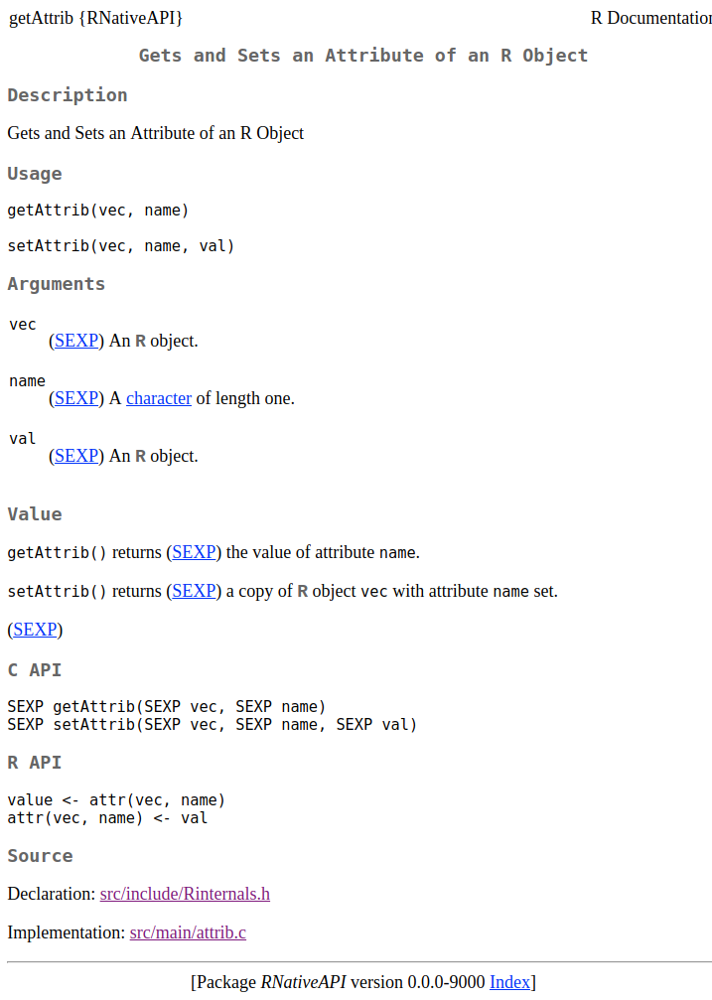

# R package: RNativeAPI - Documentation and Examples of the R Native API

A proof-of-concept package documenting the R Native API via the built-in R help system.  The help pages are written in Roxygen2 that are compiled to Rd format and then rendered by R as regular help pages.

_Disclaimer: This is just a proof of concept; I'm not claiming this is the best approach._


## Examples


### Help pages

#### HTML version




#### Text version

```r
> options(help_type = "text")
> ?RNativeAPI::getAttrib

getAttrib              package:RNativeAPI              R Documentation

Gets and Sets an Attribute of an R Object

Description:

     Gets and Sets an Attribute of an R Object

Usage:

     getAttrib(vec, name)
     
     setAttrib(vec, name, val)
     
Arguments:

     vec: (SEXP) An R object.

    name: (SEXP) A character of length one.

     val: (SEXP) An R object.

Value:

     getAttrib() returns (SEXP) the value of attribute ‘name’.

     setAttrib() returns (SEXP) a copy of R object ‘vec’ with attribute ‘name’ set.

C API:

     SEXP getAttrib(SEXP vec, SEXP name)
     SEXP setAttrib(SEXP vec, SEXP name, SEXP val)

R API:

     value <- attr(vec, name)
     attr(vec, name) <- val

Source:

     Declaration: src/include/Rinternals.h

     Implementation: src/main/attrib.c
```


## Displaying functions

```r
> RNativeAPI::getAttrib
function (vec, name) 
{
    vec = SEXP
    name = SEXP
    return(SEXP)
}
<bytecode: 0x561c1cd594c0>
<environment: namespace:RNativeAPI>
```

_Comment:_ By a customized class and `print()` method, the above can probably be presented much nice.  With some efforts, it could even display the actual source code (there are already R packages providing functionalities for this).


